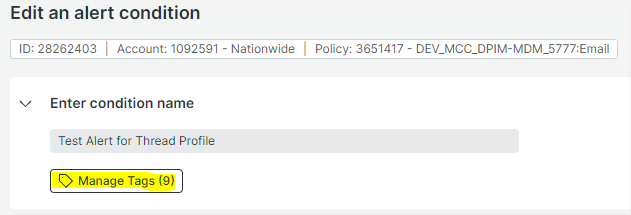
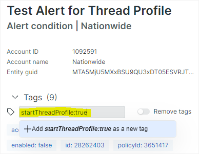
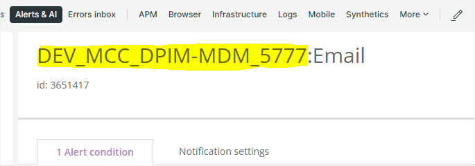
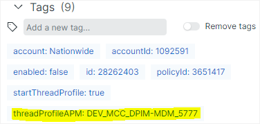
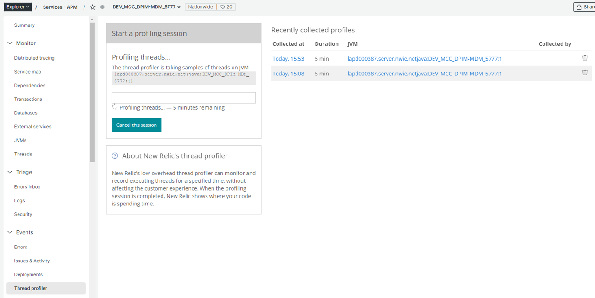
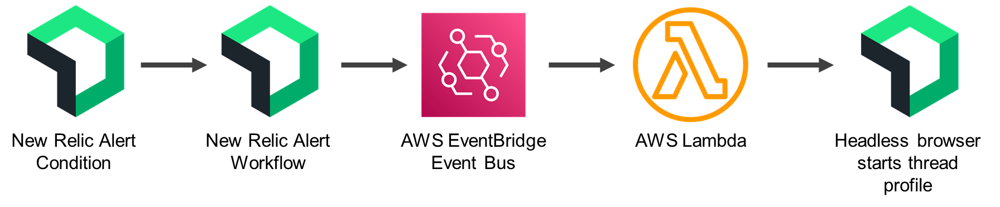
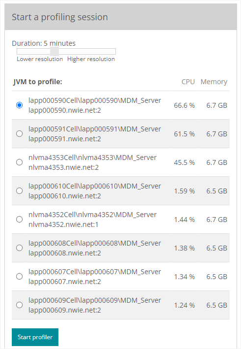

# New Relic Thread Profile Alert Trigger
This alert automation tool will start a [New Relic thread profile](https://docs.newrelic.com/docs/apm/apm-ui-pages/events/thread-profiler-tool/) for an application anytime a chosen alert condition activates. This saves time for on-call engineers who would otherwise have to start a profile manually, and improves the likelihood that a profile will capture data while the outage condition still exists.

## Setup
1. Open the alert condition you would like to have start a thread profile, and click *Manage Tags*

2. In the *Add a new tag...* entry, paste in **startThreadProfile:true**

By default, the APM name in the alert policy name will be used (assumes policy name is in [standard format](https://onyourside.sharepoint.com/sites/New_Relic/_layouts/15/Doc.aspx?sourcedoc={2cb8a6bd-4a08-4f7b-a09d-89697b06e4a9}&action=view&wd=target%28Governance.one%7C01ccbe4d-bc25-4322-8b31-1a778e2283f0%2FAlerts%7Cb0c54f55-74cf-4c61-a533-79675bed1c95%2F%29&wdorigin=NavigationUrl) of *Environment_BSA_AppName_APRMID:Channel*). T override this default, follow the step below

3. (*Optional*) To override the default APM name, add an additional tag to the alert condition of **threadProfileAPM:Environment_BSA_AppName_APRMID** (substitute *Environment_BSA_AppName_APRMID* with the APM you would like to start a profile on)

Once your alert condition activates, you should see a profile start for your application (typically within 5 minutes). The profile will run for the default duration (5 minutes) on the default JVM or Instance for the APM

## Additional Information

### Authors
Max Conover (conovm2)  
Site Reliability Engineering (sre@nationwide.com)

### How does it work?
This automation uses the [New Relic Event Bridge Lambda template](https://github.nwie.net/Nationwide/NewRelicEventBridgeLambda-python), which is a framework for writing AWS Lambda functions for alert automation. A New Relic alert tagged with **startThreadProfile:true** will qualify for a shared New Relic alert workflow. The workflow will send an event through AWS EventBridge to the Lambda function. The function uses a Selenium headless browser to log in to New Relic, navigate to the specified APM thread profile page, and initiate a new profiling session.

### Current Limitations
- Defaults for profile duration and JVM/Instance on Thread profiler page are used. This means that conditions specific to a host may not be captured.

### Logs
Application logs can be found in CloudWatch in the ProdCDT01-us-east-2 account (332335801380)

https://us-east-2.console.aws.amazon.com/cloudwatch/home?region=us-east-2#logsV2:log-groups/log-group/$252Faws$252Flambda$252FNRThreadProfileTrigger 
